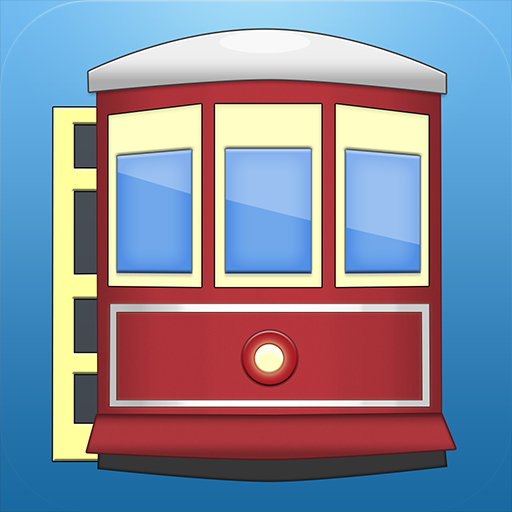
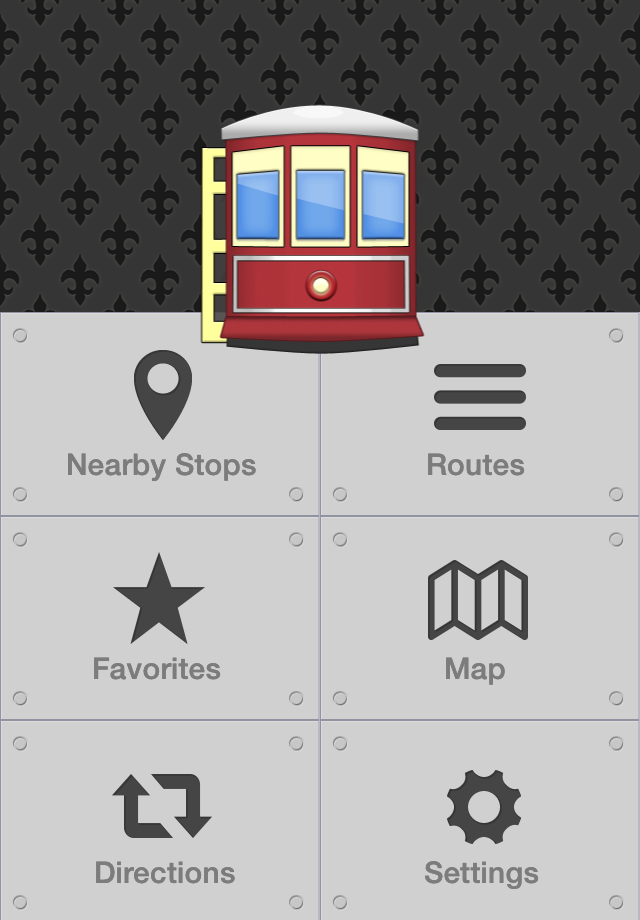
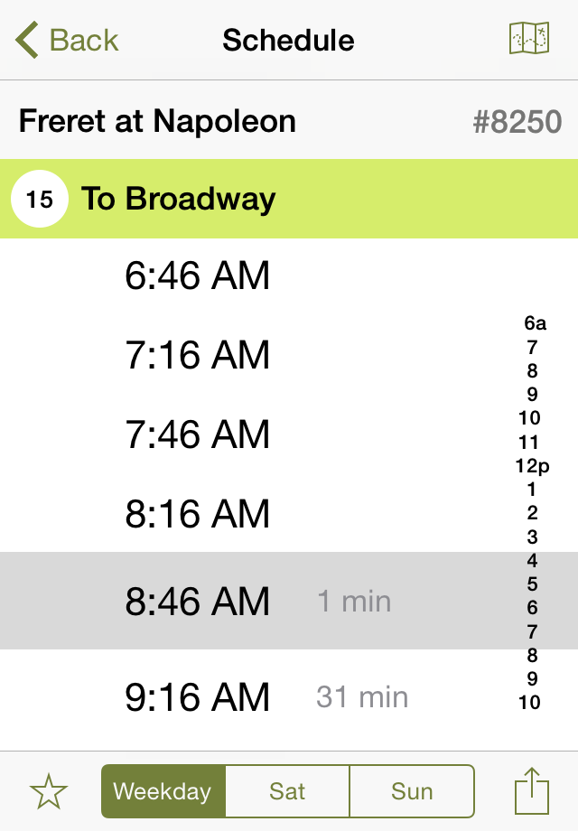
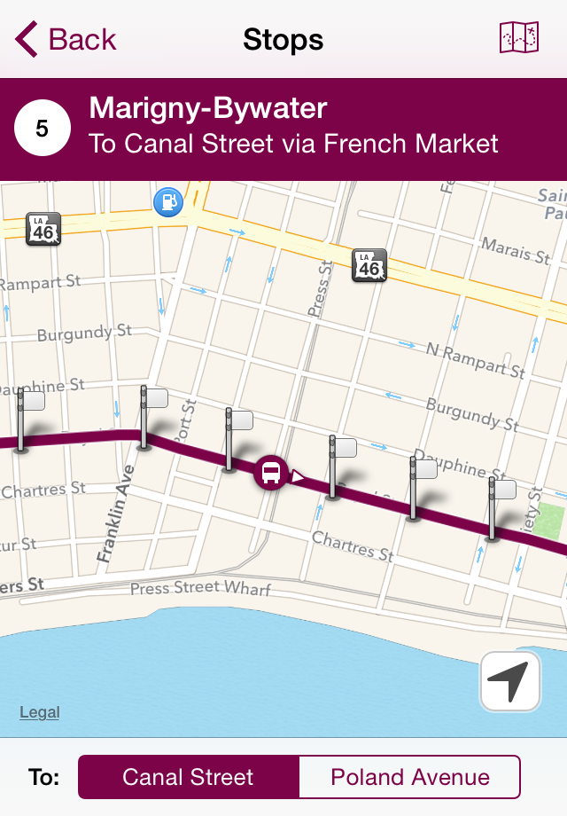
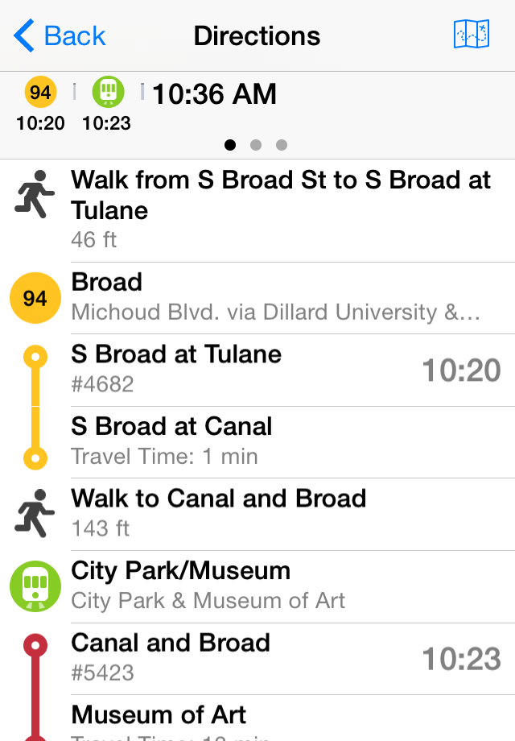

+++
title = 'NOLA transit'
+++

{.image-process-ios-icon}

NOLA Transit was the first iOS app I developed. After moving to New Orleans in 2012, I was looking for a project that I could use to learn iOS development. At the time, accessing the bus schedule on the phone for the [New Orleans RTA][rta] was very difficult because they only had PDFs of their printed schedules on the website. When the RTA started publishing a [GTFS][] feed for the bus and streetcars, I used that data to build an iOS app. This incorporated optimized trip planning via a hosted [Open Trip Planner][otp] instance and over time included real-time location data that the RTA published. 

I eventually retired this project as the RTA started implementing their own mobile apps.

{.image-process-ios-screenshot}

{.image-process-ios-screenshot}

{.image-process-ios-screenshot}

{.image-process-ios-screenshot}

[rta]: https://www.norta.com
[GTFS]: https://gtfs.org
[otp]: https://www.opentripplanner.org
