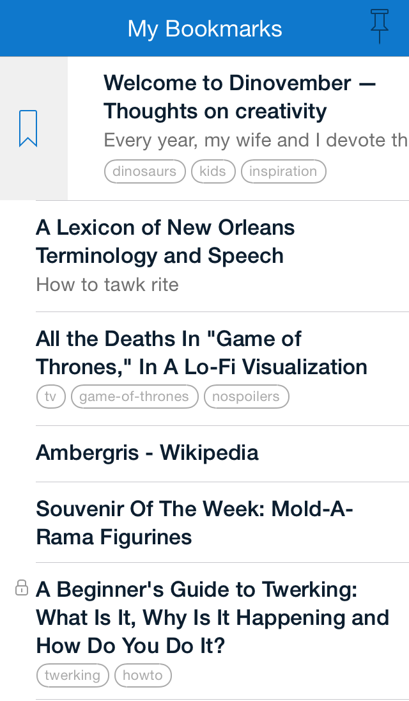
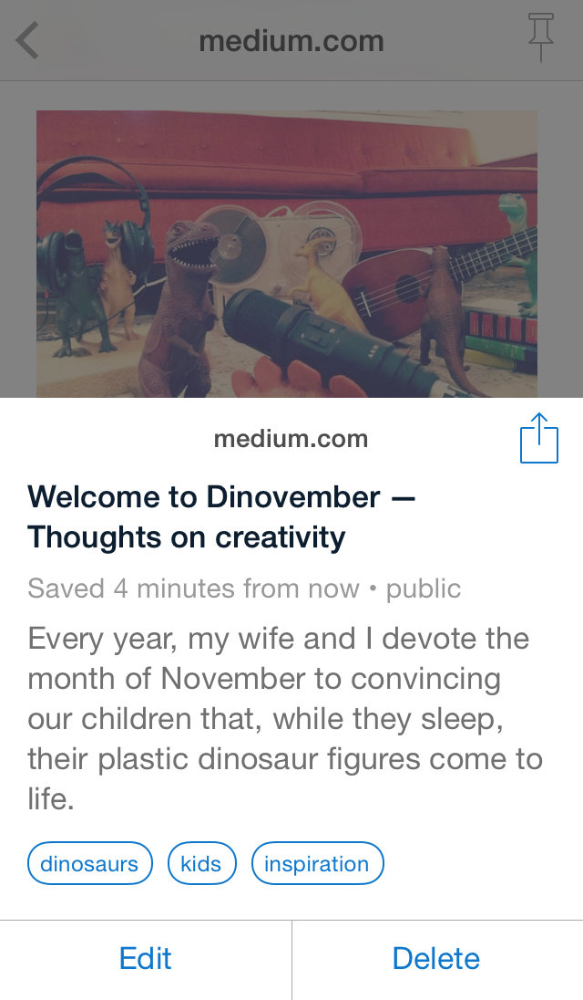
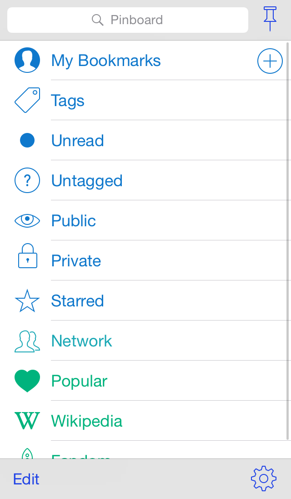
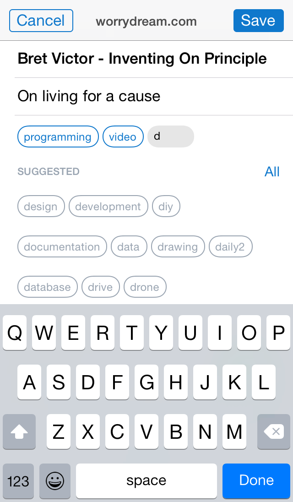
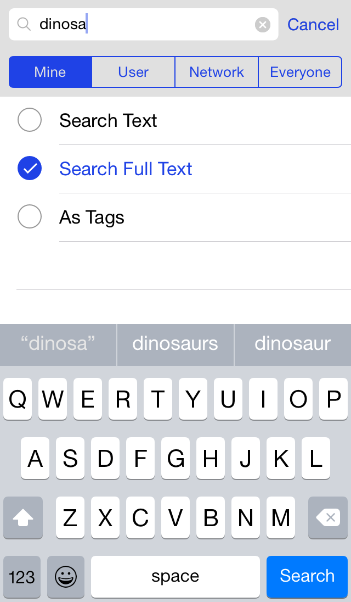

+++
title = 'Pinswift'
+++

{.image-process-ios-icon}

Pinswift was an iOS app for the [pinboard](https://pinboard.in/) bookmarking service. It was initially published in 2013 and was available until 2018

> Bring the complete power of Pinboard.in to your pocket with Pinswift. Create bookmarks with ease and use powerful search options to quickly find what you are looking for. Discover great new websites with complete support for Popular and Network lists. All of Pinboard in one fast and fun app.

Featured in [Macstories](https://www.macstories.net/reviews/pinswift-a-powerful-pinboard-client-for-ios-7/), [Tools & Toys](http://toolsandtoys.net/pinswift-for-ios/), and [Appadvice.com](https://appadvice.com/review/quickadvice-pinswift)

{.image-process-ios-screenshot}

{.image-process-ios-screenshot}

{.image-process-ios-screenshot}

{.image-process-ios-screenshot}

{.image-process-ios-screenshot}